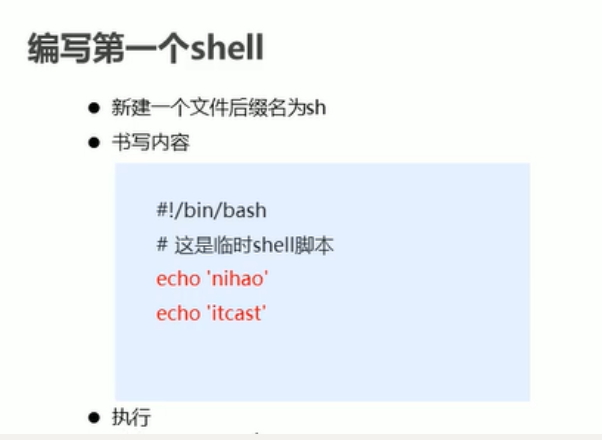
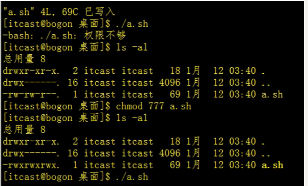
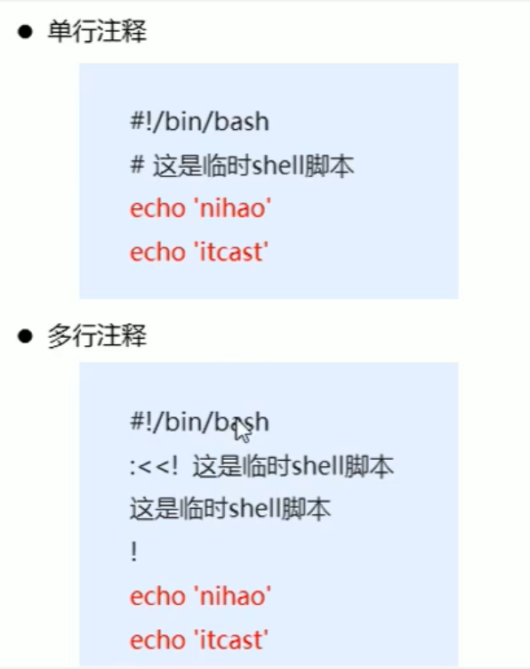
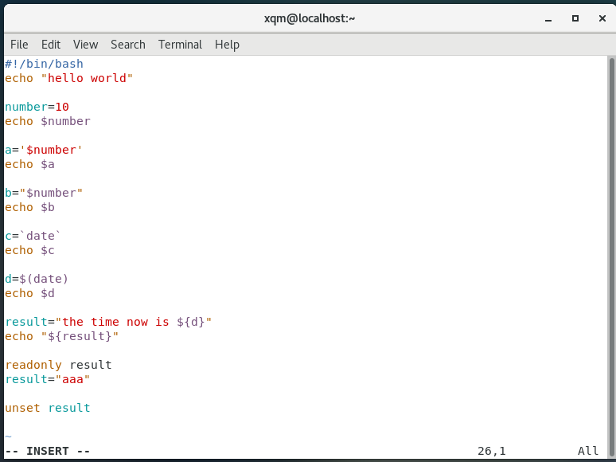
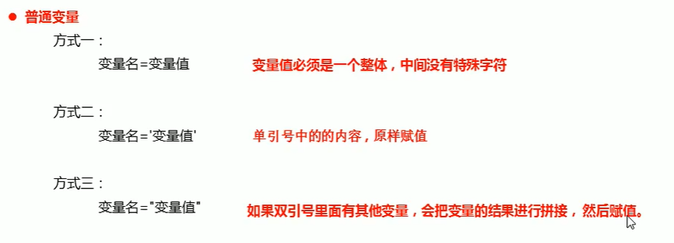
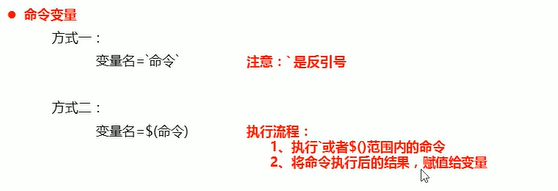
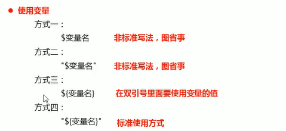
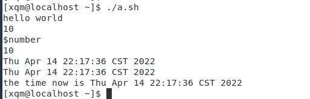
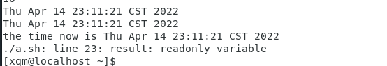

# 简单的shell编程

## 编写shell脚本



新建一个后缀为sh的文件

使用vi进入shell编译器

i开始编译模式

```shell
#!/bin/bash
echo "hello world!"
```

## 运行shell脚本的方法

（修改权限）才有执行的权限。



## shell注释



**单行**    *#+注释内容*

**多行**    *:<<!  注释内容  !*    (这是最常用的多行注释格式)，但其实多行注释中的！可以是任意的字符，只不过这里两个字符要求前后一致。举例如下，echo “hello world”一整句为注释内容，不会执行。但由于使用字符可能会给后面理解代码带来麻烦，所以通常使用！

```shell
#!/bin/bash
:<<a
echo "hello world"
a
```

## shell变量



### 1、定义变量

#### a、普通变量



数字不加引号，其他默认加双引号；

```shell
#!/bin/bash
number=10   #方式一
echo $number   #$表示取出变量的值

a='$number'   #方式二
echo $a

b="$number"   #方式三
echo $b
```

输出结果：

```shell
10
$number  #原样赋值
10
```

#### b、命令变量



```shell
#!/bin/bash
c=`date`   #date是获取当前时间的函数，注意这里是反引号
echo $c

d=$(date)
echo $d
```

输出结果：

```shell
都为当前系统的时间
```

### 使用变量



```shell
result="现在的时间为${d}"
echo "${result}"
```

输出结果：



### 只读变量

用readonly标识，在这种情况下该变量不允许被修改，被修改时会报错。

```shell
readonly result
result="aaa"
```

此时执行会报错



### 删除变量

用unset

```shell
unset result
echo "${result}"
```


